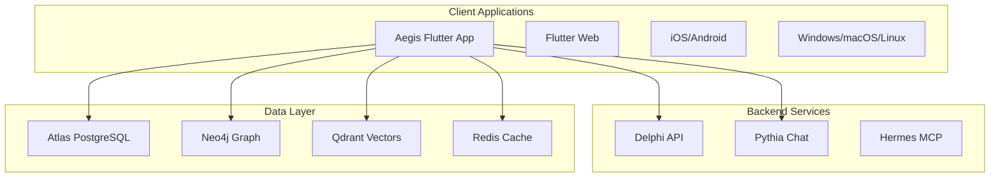

# Aegis - Flutter Intelligence Platform

**The personal shield** - Aegis provides individual protection through portable geopolitical intelligence.

## Overview

Aegis is the **cross-platform Flutter application** that brings the full Realpolitik intelligence platform to web, mobile, and desktop. Built with Flutter, it provides a consistent experience across all platforms while leveraging platform-specific capabilities.

## Architecture



## Features

### 📱 Cross-Platform Consistency
- **Single Codebase**: Flutter app runs on all platforms
- **Native Performance**: Platform-optimized rendering and interactions
- **Shared Business Logic**: Common intelligence analysis features
- **Platform-Specific UI**: Adapted interfaces for each platform

### 🌍 Intelligence Dashboard
- **3D Globe Visualization**: Interactive world map with event clustering
- **Real-Time Feed**: Live geopolitical event updates
- **Entity Tracking**: Follow specific countries, organizations, people
- **Relationship Networks**: Visualize connections and influence patterns

### 💬 Pythia Chat Interface
- **Conversational Analysis**: Natural language intelligence queries
- **Context-Aware Responses**: Historical and relationship context
- **Voice Input**: Hands-free interaction on mobile
- **Offline Support**: Cached conversations and analysis

### 🔍 Advanced Search & Filtering
- **Semantic Search**: AI-powered event similarity matching
- **Geographic Filters**: Region, country, and location-based filtering
- **Temporal Filtering**: Date ranges and time-based analysis
- **Entity Filters**: Track specific actors and relationships

### 📊 Analytics & Insights
- **Trend Analysis**: Event patterns and escalation tracking
- **Impact Assessment**: AI-generated fallout predictions
- **Custom Alerts**: Personalized notification system
- **Export Capabilities**: PDF reports and data sharing

### 🔒 Security & Privacy
- **End-to-End Encryption**: Secure communication with backend
- **Local Data Caching**: Intelligent offline capabilities
- **Biometric Authentication**: Face ID, Touch ID, Fingerprint
- **Privacy Controls**: Granular data sharing permissions

## Technology Stack

### Framework & Platforms
- **Flutter**: Cross-platform UI framework
- **Dart**: Programming language
- **Platform Targets**: Web, iOS, Android, Windows, macOS, Linux

### State Management
- **Riverpod**: Reactive state management
- **Flutter Hooks**: Simplified stateful widgets
- **Freezed**: Immutable classes and pattern matching

### Networking & APIs
- **Dio**: HTTP client with advanced features
- **WebSocket**: Real-time communication with Pythia
- **GraphQL**: Efficient data fetching (planned)
- **REST**: Standard API communication

### Data Storage
- **Hive**: Local key-value database
- **Isar**: High-performance local database
- **SharedPreferences**: User preferences
- **SecureStorage**: Sensitive data encryption

### Visualization
- **Flutter Map**: 2D map rendering
- **GL View**: WebGL for 3D visualizations
- **Custom Painters**: Custom data visualizations
- **Chart Widgets**: Statistical and trending charts

### Real-Time Features
- **Firebase Cloud Messaging**: Push notifications
- **WebSocket Streams**: Live chat and updates
- **Background Sync**: Offline data synchronization

## Project Structure

```
apps/aegis/
├── lib/
│   ├── main.dart                    # App entry point
│   ├── app/                         # App configuration
│   │   ├── app.dart                # Main app widget
│   │   └── router.dart             # Routing configuration
│   ├── core/                        # Core utilities
│   │   ├── constants/              # App constants
│   │   ├── network/                # API configuration
│   │   ├── storage/                # Local storage
│   │   └── utils/                  # Helper functions
│   ├── features/                    # Feature modules
│   │   ├── dashboard/              # Main dashboard
│   │   │   ├── screens/            # Dashboard pages
│   │   │   ├── widgets/            # Dashboard components
│   │   │   ├── models/             # Dashboard models
│   │   │   └── providers/          # State management
│   │   ├── chat/                   # Pythia chat interface
│   │   ├── globe/                  # 3D globe visualization
│   │   ├── search/                 # Search and filtering
│   │   ├── alerts/                 # Notification system
│   │   └── profile/                # User settings
│   ├── shared/                     # Shared components
│   │   ├── widgets/                # Reusable widgets
│   │   ├── themes/                 # App themes
│   │   └── models/                 # Shared data models
│   └── services/                    # Business logic
│       ├── api_service.dart        # Backend communication
│       ├── websocket_service.dart  # Real-time features
│       ├── storage_service.dart    # Local data management
│       └── notification_service.dart # Push notifications
├── assets/                         # Static assets
│   ├── images/                     # App images and icons
│   ├── fonts/                      # Custom fonts
│   └── animations/                 # Lottie animations
├── android/                        # Android-specific files
├── ios/                           # iOS-specific files
├── web/                           # Web-specific files
├── windows/                       # Windows-specific files
├── macos/                         # macOS-specific files
├── linux/                         # Linux-specific files
├── pubspec.yaml                   # Dependencies
└── analysis_options.yaml          # Dart analysis rules
```

## Development

### Setup
```bash
# Install Flutter SDK
# Follow https://flutter.dev/docs/get-started/install

# Clone and setup
cd apps/aegis
flutter pub get

# Enable web support
flutter config --enable-web

# Run on different platforms
flutter run -d chrome    # Web
flutter run -d ios       # iOS simulator
flutter run -d android   # Android emulator
flutter run -d windows   # Windows desktop
```

### Platform-Specific Commands
```bash
# iOS
flutter build ios --release
open ios/Runner.xcworkspace

# Android
flutter build apk --release
# or
flutter build appbundle --release

# Web
flutter build web --release
firebase deploy # or other hosting

# Desktop
flutter build windows --release
flutter build macos --release
flutter build linux --release
```

## Key Features by Platform

### iOS
- **Face ID Authentication**: Biometric security
- **Siri Shortcuts**: Voice-activated intelligence queries
- **Widget Support**: Home screen intelligence widgets
- **Apple Watch**: Quick intelligence updates

### Android
- **Fingerprint Authentication**: Secure access
- **Android Widgets**: Home screen intelligence widgets
- **Background Sync**: Offline data updates
- **Adaptive Icons**: Material You theming

### Web
- **Progressive Web App**: Installable web experience
- **Keyboard Shortcuts**: Power user features
- **Drag & Drop**: File and data upload
- **Clipboard Integration**: Share analysis results

### Desktop
- **Native Menus**: Platform-appropriate menu bars
- **Window Management**: Multi-window support
- **Keyboard Shortcuts**: Global hotkeys
- **System Tray**: Background intelligence monitoring

## Testing

### Unit Tests
```dart
flutter test
```

### Widget Tests
```dart
flutter test test/widget/
```

### Integration Tests
```dart
flutter test integration_test/
```

## Performance Optimization

- **Build Optimization**: Code splitting and tree shaking
- **Runtime Performance**: Efficient rendering and state management
- **Memory Management**: Proper disposal and cleanup
- **Network Optimization**: Caching and request optimization

This Flutter application provides the complete Realpolitik intelligence platform across all platforms with native performance and platform-specific optimizations.