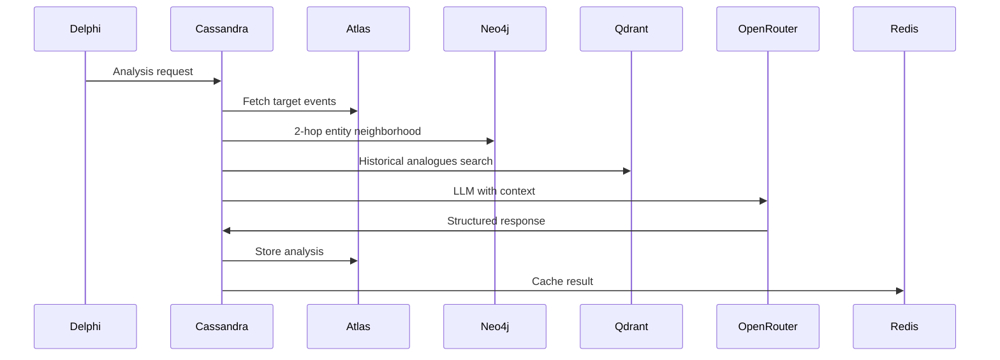

# Cassandra - Fallout Analysis Engine

**The prophetess** - Cassandra calculates the cascading doom from geopolitical events.

## Responsibilities

- **Cost Center**: Expensive LLM analysis for impact assessment
- **Context Assembly**: Builds comprehensive event context from multiple sources
- **Event-Based Invalidation**: Cache invalidation when new events affect previous analyses
- **Deduplication**: Prevents redundant analysis of same event sets
- **Structured Output**: JSON-formatted fallout predictions with cascading effects

## Analysis Pipeline



## Context Assembly

### Event Retrieval
1. **Primary Events**: Target events from request
2. **Entity Neighborhood**: Entities from Neo4j (2-hop traversal)
3. **Historical Analogues**: Similar events from Qdrant
4. **Causal Chains**: Events that led to current events
5. **Impact Network**: What current events affect

### LLM Prompt Structure
```json
{
  "system_prompt": "You are a geopolitical analyst...",
  "context": {
    "events": [...],
    "relationships": [...],
    "analogues": [...],
    "causal_chain": [...]
  },
  "analysis_request": "Analyze cascading effects..."
}
```

## Cost Optimization

### Intelligent Caching
- **Event Set Hash**: Deduplicate identical analysis requests
- **TTL with Invalidation**: Time-based + event-driven expiry
- **Cost Amortization**: Serve cached analyses to multiple users

### Cache Invalidation
```python
async def invalidate_related_analyses(new_event_id: str):
    # Find entities involved in new event
    entities = await neo4j.get_event_entities(new_event_id)
    
    # Check for cached analyses involving these entities
    for entity_id in entities:
        analyses = await redis.get_entity_analyses(entity_id)
        for cache_key in analyses:
            await redis.invalidate_analysis(cache_key)
```

## Service Configuration

```yaml
# k8s/deployment.yaml
apiVersion: apps/v1
kind: Deployment
metadata:
  name: cassandra
spec:
  replicas: 0  # Scale to 0 when no jobs
  selector:
    matchLabels:
      app: cassandra
  template:
    spec:
      containers:
      - name: cassandra
        image: realpolitik/cassandra:latest
        env:
        - DATABASE_URL: postgresql://...
        - NEO4J_URI: bolt://...
        - QDRANT_URI: http://...
        - REDIS_URL: redis://...
        - RABBITMQ_URL: amqp://...
        - OPENROUTER_API_KEY: ...
        resources:
          requests:
            memory: "512Mi"
            cpu: "250m"
          limits:
            memory: "2Gi"
            cpu: "1000m"
```

## Horizontal Pod Autoscaler

```yaml
apiVersion: autoscaling/v2
kind: HorizontalPodAutoscaler
metadata:
  name: cassandra-hpa
spec:
  scaleTargetRef:
    apiVersion: apps/v1
    kind: Deployment
    name: cassandra
  minReplicas: 0
  maxReplicas: 10
  metrics:
  - type: Queue
    queue:
      service: iris
      queue: analysis.requested
      threshold: 5  # Scale when >5 messages
```

## Development

```bash
# Install dependencies with Poetry
cd apps/cassandra && poetry install

# Run locally (consumes from queue)
poetry run python -m cassandra.main

# Or use the Task command
task dev-cassandra
```

## Documentation

- More detailed reports and verification docs can be found in the [docs/](./docs/) directory.

## Cost Tracking

```python
# Track analysis costs for billing
class AnalysisCost:
    request_id: UUID
    model_used: str
    input_tokens: int
    output_tokens: int
    cost_usd: float
    completed_at: datetime
```

## Dependencies

- PostgreSQL (Atlas) for event retrieval and analysis storage
- Neo4j (Ariadne) for entity relationships and causal chains
- Qdrant (Mnemosyne) for historical analogues search
- Redis (Lethe) for analysis caching
- RabbitMQ (Iris) for analysis request consumption
- OpenRouter for LLM inference