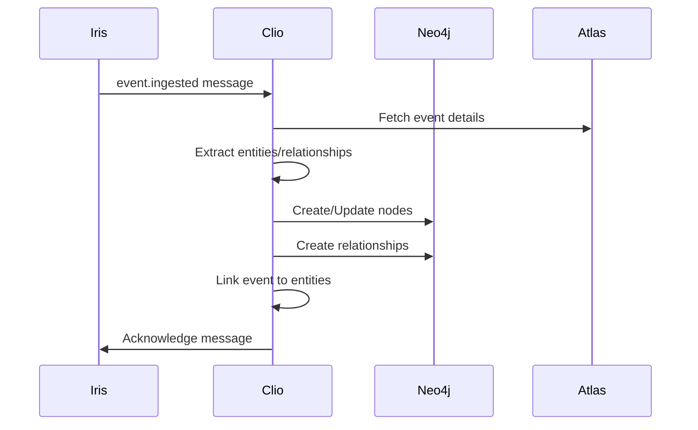

# Clio - Graph Database Writer

**Muse of History** - Clio records the deeds of states into the knowledge graph.

## Responsibilities

- **Fanout Consumer**: Processes `event.ingested` messages from RabbitMQ
- **Graph Operations**: Creates/updates nodes and edges in Neo4j
- **Entity Resolution**: Maps extracted entities to canonical nodes
- **Relationship Creation**: Establishes temporal relationships between entities
- **Compensating Transactions**: Handles failures gracefully with retries

## Graph Model

### Node Types
- **Event**: Geopolitical incidents with metadata
- **Entity**: Countries, organizations, people, facilities
- **Location**: Geographic places and regions

### Edge Types
- **INVOLVES**: Event → Entity (actor, location, affected)
- **AFFECTS**: Event → Entity (positive/negative impact)
- **ESCALATES_FROM**: Event → Event (causal chains)
- **LEADS_TO**: Entity → Entity (relationships over time)

## Processing Pipeline



## Entity Resolution

### Two-Pass Resolution
1. **Alias Lookup**: Fast exact match on names/aliases
2. **Semantic Matching**: Vector similarity for similar entities

```python
async def resolve_entity(entity_name: str, entity_type: str):
    # Pass 1: Alias lookup
    node = await neo4j.find_by_alias(entity_name)
    if node:
        return node
    
    # Pass 2: Semantic search
    embedding = await generate_embedding(entity_name)
    candidates = await neo4j.semantic_search(embedding, filter_type=entity_type)
    
    if candidates and candidates[0].similarity > 0.9:
        return candidates[0]
    
    # Create new entity
    return await neo4j.create_entity(entity_name, entity_type, embedding)
```

## Service Configuration

```yaml
# k8s/deployment.yaml
apiVersion: apps/v1
kind: Deployment
metadata:
  name: clio
spec:
  replicas: 3
  selector:
    matchLabels:
      app: clio
  template:
    spec:
      containers:
      - name: clio
        image: realpolitik/clio:latest
        env:
        - DATABASE_URL: postgresql://...
        - NEO4J_URI: bolt://neo4j:7687
        - NEO4J_USERNAME: neo4j
        - NEO4J_PASSWORD: ${NEO4J_PASSWORD}
        - RABBITMQ_URL: amqp://...
```

## Error Handling

### Compensating Transactions
```python
async def process_event(event_data):
    try:
        # Create nodes
        event_node = await neo4j.create_event_node(event_data)
        
        # Create entities
        entity_ids = []
        for entity_data in event_data.entities:
            entity_id = await resolve_entity(entity_data)
            entity_ids.append(entity_id)
        
        # Create relationships
        for rel_data in event_data.relationships:
            await neo4j.create_relationship(
                rel_data.from_entity_id,
                rel_data.to_entity_id, 
                rel_data.relationship_type
            )
            
        # Link event to entities
        await neo4j.link_event_to_entities(
            event_node.id, entity_ids, roles
        )
        
    except Exception as e:
        # Compensating transaction: cleanup partial work
        await neo4j.delete_event_node(event_node.id)
        raise
```

## Development

```bash
# Run locally (consumes from queue)
cd apps/clio && poetry run python -m clio.consumer
```

## Graph Operations

### Batch Processing
- **Bulk Creation**: Batch node/edge creation for performance
- **Transaction Management**: Single transactions for related operations
- **Conflict Resolution**: Handle concurrent modifications

### Query Optimization
- **Index Usage**: Leverage Neo4j schema indexes
- **Relationship Filtering**: Efficient edge traversals
- **Pagination**: Handle large graph results

## Dependencies

- PostgreSQL (Atlas) for event data and entity resolution
- Neo4j (Ariadne) for graph storage and queries
- RabbitMQ (Iris) for event ingestion messages
- OpenRouter for entity embeddings (if needed)