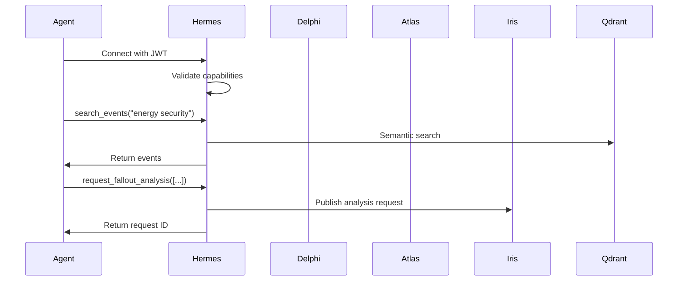

# Hermes - MCP Gateway

**Psychopomp and messenger** - Hermes safely guides AI agents into the system.

## Responsibilities

- **Agent Interface**: Model Context Protocol (MCP) server
- **Capability-based Security**: Scoped access for AI agents
- **Tool Definition**: Exposes domain-specific tools to agents
- **Audit Logging**: All agent actions logged separately
- **Resource Management**: Agent rate limiting and quotas

## MCP Tools Exposed

### Event Search
```typescript
search_events(query: string, filters?: GeoFilter): Promise<SearchResult[]>
```

### Graph Operations  
```typescript
get_event_lineage(event_id: string): Promise<GraphPath[]>
find_entity_neighbors(entity_id: string): Promise<EntityNode[]>
```

### Analysis Requests
```typescript
request_fallout_analysis(event_ids: string[]): Promise<AnalysisRequest>
```

### Entity Resolution
```typescript
resolve_entity(name: string): Promise<Entity>
```

## Security Model

### Capability-based Access
- **Event Search**: Agents can search but not modify
- **Analysis Requests**: Requires user approval for cost control
- **Graph Queries**: Read-only access to relationships
- **No User Management**: Agents cannot access billing/user APIs

### Token-based Authentication
```typescript
// Agent JWT with scoped permissions
{
  "sub": "agent-uuid",
  "capabilities": ["search", "graph.query", "analysis.request"],
  "rate_limit": 100,  // requests per hour
  "audit": true
}
```

## Agent Flow



## Service Configuration

```yaml
# k8s/deployment.yaml
apiVersion: apps/v1
kind: Deployment
metadata:
  name: hermes
spec:
  replicas: 1  # Single instance for stateful connections
  selector:
    matchLabels:
      app: hermes
  template:
    spec:
      containers:
      - name: hermes
        image: realpolitik/hermes:latest
        ports:
        - containerPort: 8002
        env:
        - DATABASE_URL: postgresql://...
        - NEO4J_URI: bolt://...
        - RABBITMQ_URL: amqp://...
        - AGENT_SECRET: ...  # JWT signing secret
```

## Development

```bash
# Run locally
task dev-hermes

# With poetry
cd apps/hermes && poetry run python -m hermes.server
```

## Audit & Monitoring

All agent actions logged to separate audit table:
```sql
CREATE TABLE agent_audit (
    id UUID PRIMARY KEY,
    agent_id TEXT NOT NULL,
    tool_called TEXT NOT NULL,
    parameters JSONB,
    result_summary TEXT,
    execution_time_ms INTEGER,
    created_at TIMESTAMPTZ DEFAULT NOW()
);
```

## Dependencies

- PostgreSQL (Atlas) for audit logging and agent management
- Neo4j (Ariadne) for graph queries
- Qdrant (Mnemosyne) for semantic search  
- RabbitMQ (Iris) for analysis requests
- mTLS infrastructure for secure agent connections