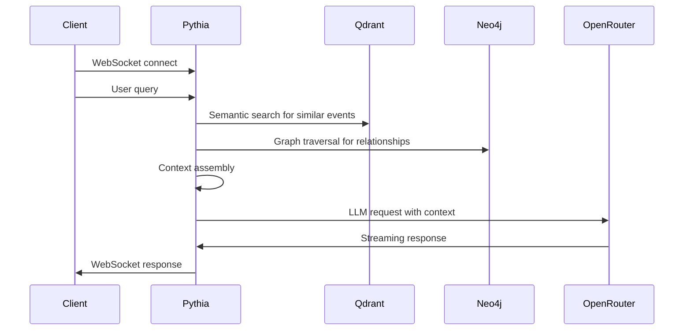

# Pythia - Chat Interface

**The high priestess** - Pythia channels Apollo's wisdom through conversational interface.

## Responsibilities

- **WebSocket Chat**: Real-time bidirectional communication
- **RAG Pipeline**: Retrieval-Augmented Generation for context-aware responses
- **Session Management**: Conversation history storage and retrieval
- **Streaming Responses**: Token-by-token response delivery
- **Memory**: Previous turns stored and retrieved per conversation

## Architecture



## RAG Pipeline

1. **Query Processing**: User question embedding
2. **Context Retrieval**: 
   - Qdrant: Semantic search for similar events
   - Neo4j: Entity relationship enrichment
3. **Context Assembly**: Combine retrieved data with conversation history
4. **LLM Generation**: OpenRouter call with structured prompt
5. **Streaming Response**: Token-by-token delivery to client

## Chat Features

- **Multi-turn conversations** with context retention
- **Event-based questions**: "What events similar to X?"
- **Relationship queries**: "How does this affect Y?"
- **Causal analysis**: "What caused this chain of events?"
- **Entity tracking**: Following specific actors over time

## Service Configuration

```yaml
# k8s/deployment.yaml
apiVersion: apps/v1
kind: Deployment
metadata:
  name: pythia
spec:
  replicas: 2
  selector:
    matchLabels:
      app: pythia
  template:
    spec:
      containers:
      - name: pythia
        image: realpolitik/pythia:latest
        ports:
        - containerPort: 8001
        env:
        - DATABASE_URL: postgresql://...
        - NEO4J_URI: bolt://...
        - QDRANT_URI: http://...
        - REDIS_URL: redis://...
        - OPENROUTER_API_KEY: ...
```

## Development

```bash
# Run locally
task dev-pythia

# With poetry
cd apps/pythia && poetry run uvicorn src.pythia.main:app --reload
```

## Session Management

```python
# Redis-backed session store
class ChatSession:
    session_id: str
    conversation_history: List[ChatMessage]
    created_at: datetime
    last_activity: datetime
    context_cache: Dict[str, Any]
```

## Dependencies

- PostgreSQL (Atlas) for conversation history
- Neo4j (Ariadne) for relationship context
- Qdrant (Mnemosyne) for semantic search
- Redis (Lethe) for session storage
- OpenRouter for LLM generation