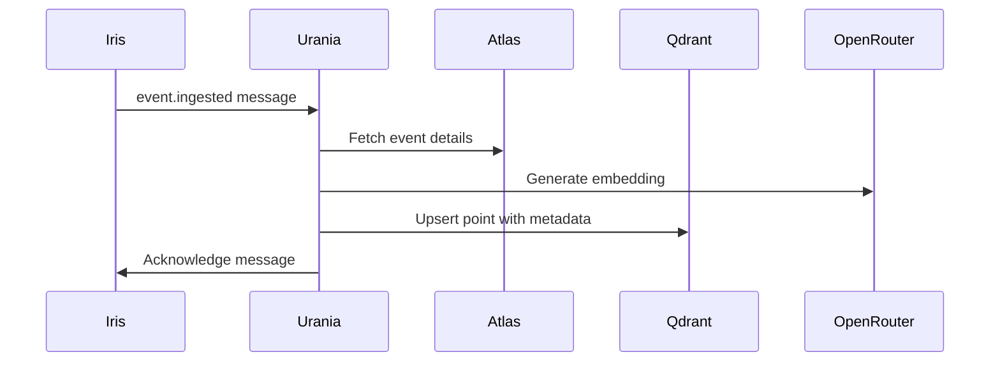

# Urania - Vector Database Writer

**Muse of Astronomy** - Urania maps the celestial spheres of embeddings.

## Responsibilities

- **Fanout Consumer**: Processes `event.ingested` messages from RabbitMQ
- **Embedding Generation**: Creates semantic vectors for events and entities
- **Vector Storage**: Stores embeddings in Qdrant with metadata
- **Collection Management**: Maintains vector collections and indexes
- **Semantic Search**: Enables "similar event" queries

## Vector Model

### Embedding Specifications
- **Event Embeddings**: 1536 dimensions for event summaries
- **Entity Embeddings**: 768 dimensions for entity names
- **Query Embeddings**: Same dimension as target collection

### Vector Collection Structure
```json
{
  "collection": "realpolitik_events",
  "points": [{
    "id": "event-uuid",
    "vector": [0.1, 0.2, ...], // 1536 dims
    "payload": {
      "event_id": "event-uuid",
      "title": "Event title",
      "summary": "Event summary",
      "category": "MILITARY",
      "severity": 8,
      "occurred_at": "2026-01-15T10:30:00Z",
      "location_name": "Gaza Strip",
      "entities": ["israel", "hamas", "gaza"],
      "embedding_model": "text-embedding-3-large"
    }
  }]
}
```

## Processing Pipeline



## Embedding Strategy

### Context for Event Embeddings
```python
def build_embedding_context(event_data):
    return f"""
    Event: {event_data.title}
    Category: {event_data.category}
    Location: {event_data.location_name}
    Summary: {event_data.summary}
    Severity: {event_data.severity}/10
    Entities: {', '.join([e['name'] for e in event_data.entities])}
    Time: {event_data.occurred_at.strftime('%Y-%m-%d')}
    """
```

### Model Selection
- **Events**: OpenRouter `text-embedding-3-large` (1536 dims)
- **Entities**: OpenRouter `text-embedding-3-large` (768 dims)
- **Fallback**: Local model if API unavailable

## Service Configuration

```yaml
# k8s/deployment.yaml
apiVersion: apps/v1
kind: Deployment
metadata:
  name: urania
spec:
  replicas: 2
  selector:
    matchLabels:
      app: urania
  template:
    spec:
      containers:
      - name: urania
        image: realpolitik/urania:latest
        env:
        - DATABASE_URL: postgresql://...
        - QDRANT_URI: http://qdrant:6333
        - RABBITMQ_URL: amqp://...
        - OPENROUTER_API_KEY: ...
        resources:
          requests:
            memory: "256Mi"
            cpu: "250m"
          limits:
            memory: "1Gi"
            cpu: "500m"
```

## Collection Management

### Index Configuration
```python
# HNSW index for fast approximate search
collection_config = {
    "vectors": {
        "size": 1536,  # Event embedding size
        "distance": "Cosine"
    },
    "hnsw_config": {
        "m": 32,
        "ef_construction": 128,
        "ef_search": 64
    },
    "optimizers_config": {
        "default_segment_number": 2
    }
}
```

### Batch Operations
```python
# Batch embedding for multiple events
async def process_batch_events(events):
    # Generate embeddings in parallel
    embeddings = await asyncio.gather(*[
        generate_embedding(event) for event in events
    ])
    
    # Batch upsert to Qdrant
    points = [
        PointStruct(id=event.id, vector=embedding, payload=event.to_dict())
        for event, embedding in zip(events, embeddings)
    ]
    
    qdrant.upsert(collection_name="realpolitik_events", points=points)
```

## Development

```bash
# Run locally (consumes from queue)
cd apps/urania && poetry run python -m urania.consumer
```

## Performance Optimization

### Embedding Caching
- **Duplicate Detection**: Hash event content to avoid re-embedding
- **Batch Processing**: Group events for efficient API usage
- **Rate Limiting**: Respect OpenRouter API limits

### Storage Optimization
- **Vector Compression**: Use half-precision where possible
- **Metadata Indexing**: Efficient filtering on payload
- **Shard Strategy**: Horizontal scaling for large datasets

## Dependencies

- PostgreSQL (Atlas) for event data retrieval
- Qdrant (Mnemosyne) for vector storage and search
- RabbitMQ (Iris) for event ingestion messages
- OpenRouter for embedding generation API