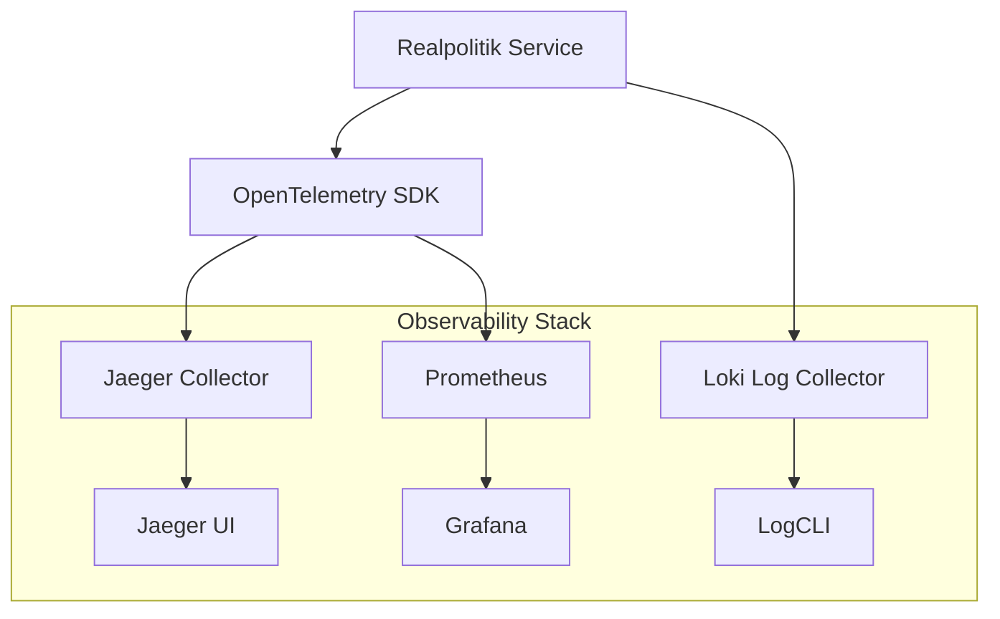

# Realpolitik Observability

**Shared OpenTelemetry setup** for distributed tracing, metrics, and logging.

## Overview

This library provides **shared observability components** used across all Realpolitik services:

- **OpenTelemetry Tracing**: Distributed request tracing
- **Prometheus Metrics**: Business and technical metrics
- **Structured Logging**: JSON logs with correlation IDs
- **Health Checks**: Service health endpoints

## Architecture



## Tracing Setup

### Service Integration

```python
from realpolitik_observability import setup_tracing, get_tracer

# In service startup
tracer = setup_tracing(
    service_name="argus",
    service_version="1.0.0",
    otlp_endpoint="http://jaeger:4317"
)

# In business logic
def process_rss_feed(feed_url: str):
    with tracer.start_as_current_span("process_rss") as span:
        span.set_attribute("feed.url", feed_url)
        
        with tracer.start_as_current_span("fetch_feed"):
            # RSS fetching logic
            pass
            
        with tracer.start_as_current_span("parse_events"):
            # Event parsing logic
            pass
```

### Cross-Service Tracing

```python
# Propagate trace context to other services
headers = {
    "traceparent": tracer.get_current_span().get_span_context().trace_state
}

# HTTP call with trace context
async with httpx.AsyncClient() as client:
    response = await client.post(
        "http://delphi/api/events",
        json=event_data,
        headers=headers
    )
```

## Metrics

### Business Metrics

```python
from realpolitik_observability import get_metrics

metrics = get_metrics()

# Event processing metrics
events_ingested_total = metrics.counter(
    "events_ingested_total",
    "Total events ingested by Argus"
)

events_by_category = metrics.gauge(
    "events_by_category",
    "Events by category",
    ["category"]
)

analysis_cost_dollars = metrics.histogram(
    "analysis_cost_dollars",
    "Analysis cost in USD",
    buckets=[0.1, 0.5, 1.0, 5.0, 10.0]
)

# Usage
events_ingested_total.add(1, {"region": "middle_east"})
analysis_cost_dollars.observe(0.25)
```

### Technical Metrics

```python
# Database connection pool
db_connections_active = metrics.gauge(
    "db_connections_active",
    "Active database connections"
)

# Queue depth
queue_depth = metrics.gauge(
    "queue_depth",
    "Message queue depth",
    ["queue_name"]
)

# LLM API calls
llm_api_duration = metrics.histogram(
    "llm_api_duration_seconds",
    "LLM API call duration"
)
```

## Logging

### Structured Logging

```python
from realpolitik_observability import get_logger

logger = get_logger("argus")

# Basic logging
logger.info("Processing RSS feed", extra={
    "feed_url": feed_url,
    "event_count": len(events)
})

# Error logging with context
try:
    await process_event(event)
except Exception as e:
    logger.error(
        "Event processing failed",
        exc_info=True,
        extra={
            "event_id": event.id,
            "error_type": type(e).__name__
        }
    )

# Audit logging
logger.info(
    "Analysis requested",
    extra={
        "user_id": user_id,
        "request_id": request_id,
        "event_count": len(event_ids),
        "analysis_type": "fallout"
    }
)
```

### Log Correlation

```python
from realpolitik_observability import correlation_context

# Link logs across services
with correlation_context(trace_id=trace_id):
    logger.info("Starting analysis")
    
    # Call other service
    response = await call_delphi()
    
    logger.info("Analysis completed")
```

## Health Checks

### Service Health Endpoint

```python
from realpolitik_observability import health_router
from fastapi import FastAPI

app = FastAPI()
app.include_router(health_router, prefix="/health")

# Custom health checks
@app.get("/health/detailed")
async def detailed_health():
    checks = {
        "database": await check_database(),
        "neo4j": await check_neo4j(),
        "qdrant": await check_qdrant(),
        "redis": await check_redis(),
        "rabbitmq": await check_rabbitmq()
    }
    
    overall_status = "healthy" if all(checks.values()) else "unhealthy"
    
    return {
        "status": overall_status,
        "checks": checks,
        "timestamp": datetime.utcnow().isoformat()
    }
```

### Dependency Health Checks

```python
async def check_database() -> bool:
    try:
        async with get_db_connection() as conn:
            await conn.execute("SELECT 1")
        return True
    except Exception:
        return False

async def check_neo4j() -> bool:
    try:
        async with get_neo4j_driver() as driver:
            async with driver.session() as session:
                await session.run("RETURN 1")
        return True
    except Exception:
        return False
```

## Configuration

### Environment Variables

```bash
# OpenTelemetry
OTEL_SERVICE_NAME=argus
OTEL_SERVICE_VERSION=1.0.0
OTEL_EXPORTER_OTLP_ENDPOINT=http://jaeger:4317
OTEL_EXPORTER_PROMETHEUS_ENDPOINT=http://prometheus:9090

# Logging
LOG_LEVEL=INFO
LOG_FORMAT=json

# Health Checks
HEALTH_CHECK_TIMEOUT=5
```

### Configuration File

```yaml
# observability.yaml
service:
  name: argus
  version: 1.0.0
  environment: production

tracing:
  enabled: true
  exporter: otlp
  endpoint: http://jaeger:4317
  sampling_rate: 0.1

metrics:
  enabled: true
  exporter: prometheus
  endpoint: http://prometheus:9090
  service_metrics: true

logging:
  level: INFO
  format: json
  include_trace: true

health:
  enabled: true
  checks:
    - name: database
      type: sql
      connection_string: ${DATABASE_URL}
    - name: redis
      type: redis
      connection_string: ${REDIS_URL}
```

## Dashboard Configuration

### Grafana Dashboards

```json
{
  "dashboard": {
    "title": "Realpolitik - Argus Service",
    "panels": [
      {
        "title": "Events Ingested Rate",
        "type": "graph",
        "targets": [
          {
            "expr": "rate(events_ingested_total[5m])",
            "legendFormat": "{{region}}"
          }
        ]
      },
      {
        "title": "Analysis Queue Depth",
        "type": "singlestat",
        "targets": [
          {
            "expr": "queue_depth{queue=\"analysis.requested\"}"
          }
        ]
      },
      {
        "title": "Analysis Cost",
        "type": "graph",
        "targets": [
          {
            "expr": "rate(analysis_cost_dollars[1h])",
            "legendFormat": "Cost per hour"
          }
        ]
      }
    ]
  }
}
```

## Alerting

### Prometheus Rules

```yaml
groups:
- name: realpolitik.rules
  rules:
  - alert: HighErrorRate
    expr: rate(http_requests_total{status=~"5.."}[5m]) > 0.1
    for: 2m
    labels:
      severity: warning
    annotations:
      summary: "High error rate detected"
      
  - alert: AnalysisQueueBacklog
    expr: queue_depth{queue="analysis.requested"} > 100
    for: 5m
    labels:
      severity: warning
    annotations:
      summary: "Analysis queue backlog detected"
      
  - alert: CDCLag
    expr: cdc_lag_seconds > 30
    for: 1m
    labels:
      severity: critical
    annotations:
      summary: "CDC pipeline lag detected"
```

## Testing

### Observability Tests

```python
import pytest
from realpolitik_observability import setup_tracing, get_tracer

@pytest.mark.asyncio
async def test_trace_propagation():
    tracer = setup_tracing("test_service")
    
    with tracer.start_as_current_span("test_span") as span:
        # Test span creation
        assert span is not None
        
        # Test span attributes
        span.set_attribute("test.key", "test_value")
        
        # Test span context
        context = span.get_span_context()
        assert context.trace_id != 0

@pytest.mark.asyncio
async def test_metrics_collection():
    metrics = get_metrics()
    
    # Test counter
    counter = metrics.counter("test_counter")
    counter.add(1)
    
    # Test gauge
    gauge = metrics.gauge("test_gauge")
    gauge.set(42.0)
    
    # Verify metrics are registered
    assert "test_counter" in metricsRegistry
    assert "test_gauge" in metricsRegistry
```

## Dependencies

- **OpenTelemetry**: `opentelemetry-api`, `opentelemetry-sdk`
- **Prometheus**: `prometheus-client`
- **FastAPI**: `fastapi` for health endpoints
- **Structlog**: Structured logging

## Performance Impact

- **Tracing Overhead**: ~1-2ms per span creation
- **Metrics Overhead**: <0.1% CPU impact
- **Logging Overhead**: Minimal with async logging
- **Sampling**: 10% trace sampling in production

## Deployment

### Kubernetes Sidecar Pattern

```yaml
apiVersion: apps/v1
kind: Deployment
metadata:
  name: argus
spec:
  template:
    spec:
      containers:
      - name: argus
        image: realpolitik/argus:latest
        ports:
        - containerPort: 8000
      - name: otel-collector
        image: otel/opentelemetry-collector:latest
        ports:
        - containerPort: 4317  # OTLP
        - containerPort: 8889  # Metrics
```

### OpenTelemetry Collector

```yaml
# otel-collector-config.yaml
receivers:
  otlp:
    protocols:
      grpc:
        endpoint: 0.0.0.0:4317

processors:
  batch:
  memory_limiter:

exporters:
  jaeger:
    endpoint: jaeger:14250
  prometheus:
    endpoint: "0.0.0.0:8889"
  loki:
    endpoint: http://loki:3100/loki/api/v1/push

service:
  pipelines:
    traces:
      receivers: [otlp]
      processors: [memory_limiter, batch]
      exporters: [jaeger]
    metrics:
      receivers: [otlp]
      processors: [memory_limiter, batch]
      exporters: [prometheus]
    logs:
      receivers: [otlp]
      processors: [batch]
      exporters: [loki]
```